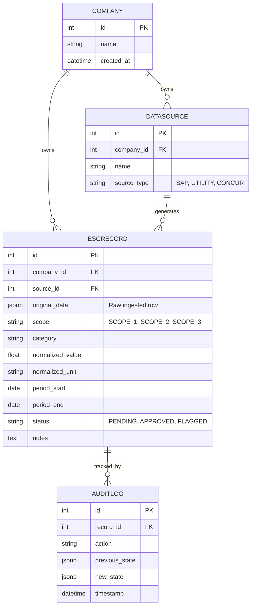

# 🗄️ Data Model

The data model is built in Django (`backend/api/models.py`) and is specifically architected to handle multi-tenancy, multiple diverse unstructured data sources, data normalization, and strict auditing.

## Entity Relationship Diagram

## Core Entities Deep-Dive

### 1. `Company` (Multi-Tenancy)
Represents a client company. All data is scoped to a specific company using a `company_id` foreign key. This ensures data isolation in a multi-tenant deployment.

### 2. `DataSource` (Source Tracking)
Represents a specific integration or upload stream for a company (e.g., *"SAP ERP US Region"*).
- Stores the `source_type` (`SAP`, `UTILITY`, `CONCUR`).
- Allows analysts to group records by where they came from and trace errors back to specific exports.

### 3. `ESGRecord` (The Core Model)
This model acts as the unified, normalized data store. It handles data from *any* source by mapping it into a common schema.

**Key Design Choices:**
- **`company` & `source`**: The owner and origin of the record.
- **`original_data` (JSONField)**: We store the *exact* raw row that was ingested. **This is critical for auditability**—if the normalization logic changes in the future, we can always refer back to the original source data without re-ingesting the files.
- **`scope` & `category`**: Categorizes the emission source (Scope 1, 2, 3) and the specific activity (e.g., *"Purchased Electricity"*).
- **`normalized_value` & `normalized_unit`**: The core activity metric mapped to standard types (e.g., converting all electricity inputs to `kWh`).
- **`period_start` & `period_end`**: Essential for Utility bills which often don't align with calendar months. SAP data usually has a single `period_start` (posting date).
- **`status`**: The workflow state (`PENDING`, `APPROVED`, `FLAGGED`). Defaults to `PENDING` for human review.

### 4. `AuditLog` (Audit Trail)
Tracks every state change to an `ESGRecord`.
- Captures the timestamp, action performed, and a diff (`previous_state` / `new_state`).
- **Why it matters:** Essential for the final auditor sign-off. Auditors must be able to see who approved a record and whether the numbers were modified after ingestion.
